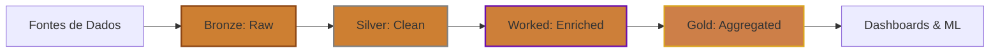

# Camada Worked na Arquitetura Medallion

## O Que É a Camada Worked?

A **Camada Worked** é uma extensão da arquitetura Medallion tradicional (Bronze → Silver → Gold), posicionada entre **Silver** e **Gold**. Ela representa dados que já foram limpos e validados (Silver), mas que receberam **enriquecimento adicional** com regras de negócio complexas, joins entre múltiplas fontes e transformações avançadas.

---

## Diferenças Entre as Camadas

| Camada | Propósito | Características | Exemplo |
|--------|-----------|-----------------|---------|
| **Bronze** | Ingestão Raw | Dados brutos, sem transformação | JSON de API, CSV de upload |
| **Silver** | Limpeza & Validação | Schema definido, tipos corretos, deduplicação | Tabela `vendas_clean` com tipos corretos |
| **Worked** | Enriquecimento & Regras de Negócio | Joins complexos, cálculos derivados, features de ML | Tabela `vendas_enriched` com margem, categoria, região |
| **Gold** | Agregação & Consumo | Métricas de negócio, KPIs, dashboards | Tabela `vendas_diarias_por_regiao` |

---

## Quando Usar a Camada Worked?

### ✅ Use Worked Quando:

1. **Joins Complexos**: Você precisa cruzar múltiplas tabelas Silver (ex: Vendas + Clientes + Produtos).
2. **Feature Engineering**: Criação de features para Machine Learning (ex: RFM Score, Lifetime Value).
3. **Regras de Negócio Avançadas**: Aplicação de lógica complexa que não é simples limpeza (ex: cálculo de margem considerando descontos progressivos).
4. **Dados Intermediários Reutilizáveis**: Quando múltiplas tabelas Gold dependem da mesma transformação intermediária.

### ❌ Não Use Worked Se:

- Suas transformações são simples agregações (vá direto de Silver para Gold).
- Você tem poucos joins ou regras de negócio (Silver já é suficiente).
- Seu time é pequeno e a complexidade adicional não justifica a manutenção.

---

## Exemplo Prático: E-commerce

### Bronze (Raw)
```json
{
  "order_id": "12345",
  "customer_id": "C001",
  "product_id": "P500",
  "quantity": 2,
  "price": 49.90,
  "timestamp": "2026-01-14T10:30:00Z"
}
```

### Silver (Clean)
```sql
-- Tabela: orders_clean
SELECT 
    order_id,
    customer_id,
    product_id,
    quantity,
    CAST(price AS DECIMAL(10,2)) AS price,
    CAST(timestamp AS TIMESTAMP) AS order_timestamp
FROM bronze.orders
WHERE quantity > 0 AND price > 0;
```

### Worked (Enriched)
```sql
-- Tabela: orders_enriched
SELECT 
    o.order_id,
    o.customer_id,
    c.customer_name,
    c.customer_segment,  -- Ex: "Premium", "Regular"
    o.product_id,
    p.product_name,
    p.product_category,
    o.quantity,
    o.price,
    p.cost,
    (o.price - p.cost) * o.quantity AS margin,  -- Regra de negócio
    o.order_timestamp,
    DATE_TRUNC('month', o.order_timestamp) AS order_month
FROM silver.orders_clean o
LEFT JOIN silver.customers_clean c ON o.customer_id = c.customer_id
LEFT JOIN silver.products_clean p ON o.product_id = p.product_id;
```

### Gold (Aggregated)
```sql
-- Tabela: monthly_sales_by_segment
SELECT 
    order_month,
    customer_segment,
    COUNT(DISTINCT order_id) AS total_orders,
    SUM(quantity) AS total_quantity,
    SUM(price * quantity) AS total_revenue,
    SUM(margin) AS total_margin
FROM worked.orders_enriched
GROUP BY order_month, customer_segment;
```

---

## Benefícios da Camada Worked

1. **Reutilização**: Evita duplicação de joins complexos em múltiplas tabelas Gold.
2. **Testabilidade**: Regras de negócio ficam isoladas e mais fáceis de testar.
3. **Performance**: Materializar joins pesados uma vez, em vez de recalcular em cada query Gold.
4. **Governança**: Centraliza transformações críticas em um único ponto.

---

## Stack Tecnológico Recomendada

- **Spark**: Para processar grandes volumes com joins distribuídos.
- **Delta Lake**: Para ACID transactions e time travel.
- **dbt**: Para modelar transformações SQL de forma modular.
- **Great Expectations**: Para validar qualidade de dados na entrada da Worked.

---

## Diagrama Mermaid



---

## Conclusão

A **Camada Worked** não é obrigatória, mas se torna essencial em arquiteturas de dados maduras onde:

- Múltiplas fontes precisam ser combinadas.
- Regras de negócio complexas são aplicadas.
- Features de ML precisam ser reutilizadas.
- Performance e governança são prioridades.

**Regra de Ouro**: Se você está duplicando o mesmo join ou transformação em 3+ tabelas Gold, considere criar uma camada Worked.

---

**Dados em Chamas** 🔥  
*Engenharia de Dados com Python e Spark*
